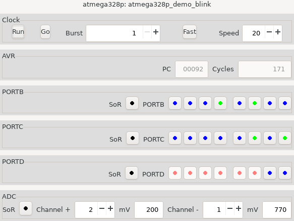

This repository is a fork from the original [here.](https://github.com/buserror/simavr)

New Features
------------
At the time of writing (March 2021) this fork contains some new or updated items.

+ A brief "Getting Started" guide, intended for new users.  See below, but the
HTML file in the doc directory looks better.  Github's HTML processing is a little off.
+ A GUI control panel for a simulated AVR. A picture and a short description are in the guide, below.
+ Improvements to the ADC, particularly attinyX5.
+ Some additional tests.
+ Miscellaneous bug fixes.

<H3>Getting Started with Simavr. </H3>
This is a guide to getting started with,
<A href="https://github.com/buserror/simavr">
<I>simavr</I>
</A>
"a lean and mean Atmel AVR simulator".
It is intended as a supplement to the existing documentation
and describes how to load and run AVR firmware in the simulator
and how to begin writing code that simulates the rest of your circuit.

You are assumed to be familiar with downloading and building
open-source software.
If not, specific instructions for
<I>simavr</I>
can be found in the PDF manual.
Before you start you will need the ELF library,
<I>libelf</I>
and an AVR toolchain (programs for building AVR programs).
The preferred toolchain is
<I>gcc-avr</I>
but anything that can produce Intel HEX files should work.
If using <I>gcc-avr</I> with C or C++,
you will also probably need the C library,
<I>avr-libc.</I>

Suppose you have downloaded and (if necessary) built simavr.
Now what?

You have a program called <I>run_avr</I>, or possibly <I>simavr</I>
that can load and run AVR programs (firmware).
You also have the simulator built as a library
that can be combined with your own software
in a more complete circuit simulation.
This guide is mostly an introduction to the library.
The tree also contains some examples of using the library
and some tests to verify that simavr is working properly.

<H4>Using <I>run-avr</I>.</H4>
An easy way to get your firmware compiled and running
with <I>gcc-avr</I> is to create a new sub-directory of
<I>simavr/examples</I>
containing your firmware source and a simple Makefile
<A href=./examples/panel/Makefile>like this one.</A>
The simavr convention is that C source files with names beginning
"attiny" or "atmega" are firmware: the first component of the name
identifies the target AVR part
and is used to select the appropriate compiler options.
If your new directory has a name beginning "board_",
the Makefile will be called by those higher in the directory tree.
The execute your firmware, invoke
<I>run-avr</I>
with the compiled firmware as the only non-option argument.

While your firmware is running,
<I>run-avr</I>
can show the instructions being executed, using the
<I>"-trace"</I>
option, and can also trace actions in the peripherals.
These tracing options are disabled by default and are enabled by modifying
<I>simavr/Makefile</I> to turn on CONFIG_SIMAVR_TRACE and recompiling.

The interface from your firmware program to the world is a simulation of the
interface of physical AVR microcontrollers:
voltages input and output on the device's pins.
The simulator can emulate these voltages by reading and writing
Value Change Dump (VCD) files,
controlled by command line options and data in the firmware file.
VCD files are formatted text files, but are not intended to be read directly.
There are tools, for example
<A href="http://gtkwave.sourceforge.net/">
<I>gtkwave</I>
</A>
for displaying VCD files but, as far as I know,
no dedicated software tools for creating them.
Two programs that may help are
<A href="https://sourceforge.net/projects/simutron/">
<I>simutron</I>
</A>
a graphical circuit designer/emulator that supports simavr,
VCD and mouse input, and
<A href="http://vcdmaker.org/">
<I>vcdmaker</I>
</A>
a utility for extracting information from files and generating VCD data.

VCD input files used for input must follow a convention for variable names
that match the
<I>printf()</I>
format
<I>"%c%c%c%c_%d".</I>
The inserted values correspond to the last two arguments to
<I>avr_io_getirq(),</I>
described below.
The next section describes another option for creating VCD input files
following that convention.

<H4>Options in firmware.</H4>
A slightly unusual feature of
<I>simavr</I>
is that options for the simulator can be specified by macro calls
included in the firmware (ELF compilation only).
In some cases there is no other way to set them.
These options include peripheral tracing details, VCD file tracing details,
some analogue voltage inputs and others.
Details are in the file
<I>simavr/simavr/sim/avr/avr_mcu_section.h.</I>

<H4 id="panel">Interactive <I>run-avr</I>.</H4>
The version of
<I>run-avr</I>
in the
<A href="https://github.com/gatk555/simavr">
gatk555
</A>
fork that contains this file has an additional option
<I>"--panel"</I>
that displays an interactive control panel,
allowing you to control firmware execution, view output and provide inputs.

At the top of the window is the "Clock" sub-panel that controls execution:
"Run" is a toggle button to start and stop execution,
"Go" executes a limited number of instructions, set by the
"Burst" entry field.
The "Fast" button makes the simulator run at full speed, with the display
updated only at the end of a burst.
Otherwise, the speed is set by "Speed" field.
The units are 0.1Hz, so 20 means two AVR cycles per second.

The current Program Counter and cycle count are shown below,
followed by sub-panels for the GPIO ports and ADC (if present).
GPIO pins are colour-coded:
0 and 1 are shown as black/red for outputs, blue/green for inputs.

Buttons labelled "SoR" are for Stop-on-read: execution will
be halted when the AVR reads that input source.
The button changes from red to green when the halt occurs.
A new input value can then be entered and execution continued.
Use the Enter key after entering new ADC inputs,
otherwise they are visible but not sent.

If <I>"--panel"</I> is used with <I>"--output"</I>,
the inputs from the control panel are captured in a separate VCD file
that can be played back later with <I>"--input"</I>.
This may be useful for creating test data files and demonstrations.
Playback can be combined with additional interactive input.

The panel uses
<I>blink,</I>
a small library based on Gtk.
Its source can be found in the
<A href="https://github.com/gatk555/blink">
<I>gatk555/blink</I>
</A>
 repository.
To build the version with the panel,
make a symbolic link to the blink source directory:
<I>simavr/simavr/sim/blink</I>
or use a real directory and put the blink source or outputs there.

<H4>Using <I>libsimavr</I>.</H4>
If you are developing new code to work with <I>libsimavr</I>,
it is likely that you will need to change the source code,
if only for debugging.
So it is better to use the library and headers from the build tree,
rather than installed version.
After building from source, the library can be found in a directory
<I>simavr/simavr/obj*'</I> with the full name depending on your hardware
and OS, and the headers are in <I>simavr/simavr/sim.</I>

<H5>Initialisation.</H5>
The first step is developing a program that uses <I>libsimavr</I>
is to create an instance of a simulated MCU and load the firmware.
Then it needs to be connected to some kind of external circuit simulation
and code to start and possibly control execution.
It may be worth considering adding new functions to <I>run_avr</I>
rather than writing a new program,
as the initialisation and some control code is already there.
That is how the control panel was implemented.

Because an ELF firmware file can contain parameters for the simulator,
the first step is to read the file:
<PRE>
	elf_firmware_t  fw = {{0}};  //  Must be initialised,
        char           *firmware;

	if (elf_read_firmware(firmware_file_name, &fw)) {
	    // Handle failure here
</PRE>
The procedure for a HEX file is slightly more complicated.
The code can be found in run_avr.c, or in the gatk555 fork
there is a function
<I>avr_setup_firmware()</I>
declared in
<I>simavr/simavr/sim/sim_hex</I>
that handles both file formats.
When using HEX format, the
<I>elf_firmware_t</I>
structure must then be further initialiased with the name and clock frequency
of the specific AVR part:
<PRE>
	strcpy(fw.mmcu, name);
	fw.frequency = f_cpu;
</PRE>
With the firmware prepared for loading, the next step is to create
the simulated microcontroller and load the firmware:
<PRE>
	avr_t *avr;

	avr = avr_make_mcu_by_name(f.mmcu);
	if (!avr) {
		fprintf(stderr, "%s: AVR '%s' not known\n", argv[0], f.mmcu);
		exit(1);
	}
	avr_init(avr);
	avr_load_firmware(avr, &f);
</PRE>
The simulator is now ready to run.
The simplest option:
<PRE>
	for (;;) {
		int state = avr_run(avr);
		if (state == cpu_Done || state == cpu_Crashed)
			break;
	}
</PRE>
By default, the loop executes one instruction at a time.
To make simulation faster, a burst size can be set as
<I>avr->run_cycle_limit.</I>

<H5>Connecting the external circuit.</H5>
If the firmware is to do anything,
there needs to be a connection to a simulated external circuit.
In most cases this will use the digital input and output functions
of the AVR general-purpose I/O ports (GIOPs).
Some internal peripheral simulations route through the GIOP simulation,
so external code does not need to consider what goes on inside,
others are handled through their own interfaces.

External code interacts with simavr through function calls labelled "IRQ",
described in <I>simavr/simavr/sim/sim_irq.h.</I>)
Pointers to structures
(<I>struct avr_irq_t</I>)
serve as "handles" to events and operations within the simulator.
Each peripheral, including the 8-bit GPIO ports has a list of IRQs
that it publishes and
the first step in connecting code to the simulation is to obtain an
IRQ pointer.
This is how to get access to output on the 8 PORTB pins of an AVR:
<PRE>
	avr_irq_t *output_handle;
        uint32_t   ioctl;

        ioctl = (uint32_t)AVR_IOCTL_IOPORT_GETIRQ('B');
	output_handle = avr_io_getirq(avr, ioctl, IOPORT_IRQ_REG_PORT);
</PRE>
The second argument selects the peripheral and the third the specific IRQ
supported by the peripheral.

There are two basic actions on an IRQ: pass a value into the simulator,
or request that the simulator calls an external function when an event
associated with the IRQ occurs.
Most IRQs support only one of these methods, some support both.
The direction is given in the IRQ's name, which can be found in the
structure or seen near the end of the peripheral's source code file.
In
<I>simavr/simavr/sim/avr_ioport.c</I>
that IRQ's name is shown as "8>port".
That means it is associated with 8 bits of data and the transfer direction
is from the MCU to the outside.
An external function must be connected to this IRQ to see output from the port.
<PRE>
// This function will be called when the AVR changes the port output.

static void d_out_notify(avr_irq_t *irq, uint32_t value, void *param)
{
	// Do something with param and value ...
}

        // ... back in main program initialisation.

	avr_irq_register_notify(output_handle, d_out_notify, param);
</PRE>
The third argument is a void pointer that is passed through to the
called function.
Usually it will be a pointer to a program structure representing the
connections to the port.
If the pin assignments to input or output are not fixed for the duration
of execution it is also necessary to track the port direction register.
The panel code does it like this.
<PRE>
/* Notification of output to a port. This is called whenever the output
 * or data direction registers are written.  Writing to the input register
 * to toggle output register bits is handled internally by simavr
 * and appears as an output register change.
 *
 * New pin values are calculated ignoring pullups, including simavr's
 * external pullup feature - the panel provides "strong" inputs.
 */

static void d_out_notify(avr_irq_t *irq, uint32_t value, void *param)
{
    struct port *pp;
    uint8_t      ddr, out;

    pp = (struct port *)param;
    if (irq->irq == IOPORT_IRQ_DIRECTION_ALL) {
        Bfp->new_flags(PORT_HANDLE(pp, 0), ~value);
        ddr = pp->ddr = (uint8_t)value;
        out = pp->output;
    } else {
        ddr = pp->ddr;
        out = pp->output = (uint8_t)value;
    }
    pp->actual = (out & ddr) | (pp->actual & ~ddr);
    Bfp->new_value(PORT_HANDLE(pp, 0), pp->actual);
}

...

        ioctl = (uint32_t)AVR_IOCTL_IOPORT_GETIRQ(port_letter);
        base_irq = avr_io_getirq(avr, ioctl, 0);

...

if (base_irq != NULL) {
            /* Some port letters are skipped. */

...

            avr_irq_register_notify(base_irq + IOPORT_IRQ_REG_PORT,
                                    d_out_notify, pp);
            avr_irq_register_notify(base_irq + IOPORT_IRQ_DIRECTION_ALL,
                                    d_out_notify, pp);

</PRE>
The handler combines input and output values to produce a single byte value
for display.
This takes advantage of two additional features of IRQs:
each peripheral IRQ includes its own selector value
(<I>irq->irq;</I>)
and the IRQs for any one peripheral form an array
(there are some exceptions),
so it is really only necessary for call
<I>avr_io_getirq()</I>
once for each peripheral used.
(Another useful feature is that the IRQ structure contains the value passed
on the previous call, so it easy to detect changes.)

The first 8 GPIO IRQ's are assigned to individual pins and are bi-directional.
(There is an infinite recursion hazard!)
These IRQ's are the way to do digital input and
<I>avr_raise_irq()</I>
is the usual way to pass values into the simulation.
This simplified example is from the panel code.
<PRE>
    unsigned int             changed, mask, dirty, i;

    changed = value ^ pp->actual;
    if (changed) {
        /* Scan for changed bits. */

        for (i = 0, mask = 1; i < 8; ++i, mask <<= 1) {
            if (mask & changed) {
                    int bit;

...

                    bit = ((value & mask) != 0);

                    /* Push changed bit into simavr.
                     * The first 8 IRQs set individual bits.
                     */

                    avr_raise_irq(pp->base_irq + i, bit);

</PRE>
If pin-change interrupts on a port and other digital peripherals are not used,
it is possible to delay setting new input values until the firmware reads them.
A handler for the IOPORT_IRQ_REG_PIN IRQ will be called when the port is read.
New pin values can be set in the handler.

<H5>Analogue input peripherals</H5>
The analogue input peripherals are the ADC and the comparator.

For these peripherals, the external code needs to set a voltage
(in millivolts) on an input pin.
Simavr treats analogue input as completely separate from digital I/O,
even though in reality they share pins.
There is nothing in Simavr that connects the two, so it will allow you
to do digital output on a pin that you are simultaneously using for
analogue input.

This fragment shows the IRQs used for analogue input to the ADC.
<PRE>
	avr_irq_t *ADC_base_irq;

	ADC_base_irq = avr_io_getirq(avr, AVR_IOCTL_ADC_GETIRQ, 0);

...

	avr_raise_irq(ADC_base_irq + n, millivolts); // Set ADCn

</PRE>
As with the GPIO ports, there is an outbound IRQ, ADC_IRQ_OUT_TRIGGER,
whose handler will be called when analogue input is sampled,
and a new value can be set in the handler.
The 32-bit value passed to the handler is a structure (not a pointer)
with bit fields indicating the type of input
(single source, differential or special-purpose) and the source(s).
New values for the conventional ADC channels can be set in the handler.

The analogue comparator can share the physical ADC inputs on some variants
and has its own inputs.
Simavr treats all of these as independent of both GIO and ADC inputs.
Although ADC_IRQ_ADC1 and ACOMP_IRQ_ADC1 represent the same pin,
those are different numbers and simavr will allow you to set
different voltages.
Providing input values for the comparator is similar to the ADC,
except that monitoring is continuous,
so there is no IRQ to intercept reads.
ACOMP_IRQ_OUT offers notification of changes to the comparator's output bit.
<PRE>
	avr_irq_t *AC_base_irq;

	AC_base_irq = avr_io_getirq(avr, AVR_IOCTL_ACOMP_GETIRQ, 0);

...

	avr_raise_irq(AC_base_irq + channel, millivolts);

</PRE>

<H5>Other peripherals.</H5>
It might seem that the IRQs mentioned above are all that are needed,
as all the chip functions visible to external circuits use an I/O pin.
That is true for the timers; their externally-visible function
are routed through the GPIO ports.

The serial communication periperals (UART, SPI, TWI) are different,
as transmissions do not modify pin state and reception does not examine it.
Instead, each peripheral has its own IRQs to send and recieve bytes.
That simplifies both the simulator and external code,
and the omission should only be visible if the pins used
are also linked to unrelated external circuitry.
If you think of doing that, this restriction is telling you to choose
an AVR with more pins.

<H5>Simavr Timers.</H5>
The implementation of peripherals such as serial communications and the ADC
(and simulated AVR timers!) requires timed events that are independent
of the firmware but must be synchronised with its execution.
The same interface can be used when simulating external circuitry.
Like IRQs, this is a callback interface.
This example from device simulation
<I>simavr/examples/parts/hd44780.c</I>
also shows how external simulation code can also create and use its own IRQs.
<PRE>
static avr_cycle_count_t
_hd44780_busy_timer(
		struct avr_t * avr,
        avr_cycle_count_t when, void * param)
{
	hd44780_t *b = (hd44780_t *) param;
	hd44780_set_flag(b, HD44780_FLAG_BUSY, 0);
	avr_raise_irq(b->irq + IRQ_HD44780_BUSY, 0);
	return 0;
}

...

	if (delay) {
		hd44780_set_flag(b, HD44780_FLAG_BUSY, 1);
		avr_raise_irq(b->irq + IRQ_HD44780_BUSY, 1);
		avr_cycle_timer_register_usec(b->avr, delay,
			_hd44780_busy_timer, b);
	}
</PRE>
The return value from a timer function specifies when and if it will be
called again.
The
<I>avr_cycle_timer_register()</I>
function specifies the delay in clock cycles rather than time.
There are also functions to cancel a timer or query its status
(<I>sim_cycle_timers.h</I>).

<H5>Other features.</H5>
For many applications, the few function calls shown above are
all that is needed.
One other thing an application may need to do is to take full control
of execution.
That is done with a dedicated
<I>run()</I>
function.
It is required to call the simulator core to execute a burst
of instructions (usually one),
then check for and handle pending interrupts, timer events
and the sleep states.
The standard version handles sleep with delays,
so that execution occurs in approximately real time.
A different run function is needed to run at full speed,
as in this example from
<I>simavr/simavr/sim/panel.c</I>
As before, it needs to be called in a loop until simulation ends.
<PRE>
static int my_avr_run(avr_t *avr)
{
    avr_cycle_count_t sleep;
    uint16_t          new_pc;

    if (avr->state == cpu_Stopped)
        return avr->state;

    new_pc = avr->pc;
    if (avr->state == cpu_Running)
        new_pc = avr_run_one(avr);

    // Run the cycle timers, get the suggested sleep time
    // until the next timer is due.

    sleep = avr_cycle_timer_process(avr);
    avr->pc = new_pc;

    if (avr->state == cpu_Sleeping) {
        if (!avr->sreg[S_I]) {
            printf("simavr: sleeping with interrupts off, quitting.\n");
            avr_terminate(avr);
            return cpu_Done;
        }
        avr->cycle += 1 + sleep;
    }

    // Interrupt service.

    if (avr->state == cpu_Running || avr->state == cpu_Sleeping)
        avr_service_interrupts(avr);
    return avr->state;
}
</PRE>

An application might also need to implement an additional AVR peripheral,
real or virtual.
For that, there are functions to monitor reads and writes
to memory and I/O register space, such as
<I>avr_register_io_write()</I>
and
<I>avr_core_watch_read().</I>
Interrupts can be raised with
<I>avr_raise_interrupt()</I>
and controlled using other functions defined in
<I>sim_interrupts.h.</I>
